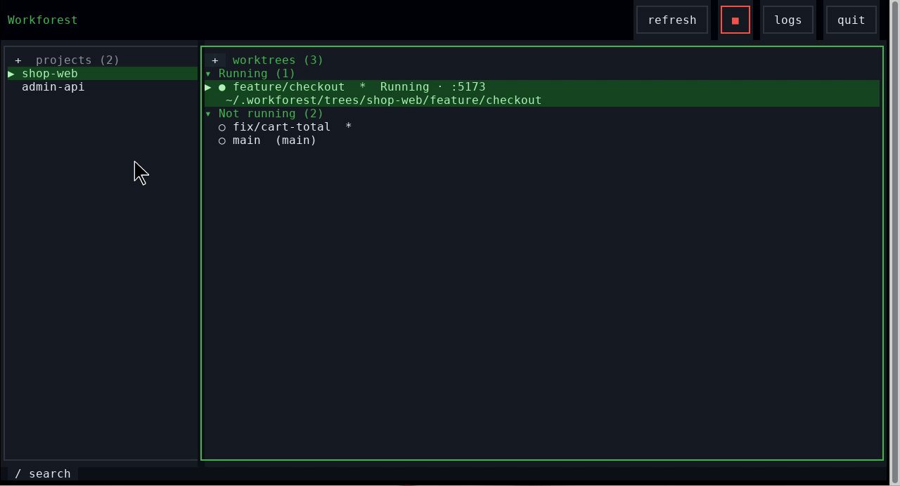
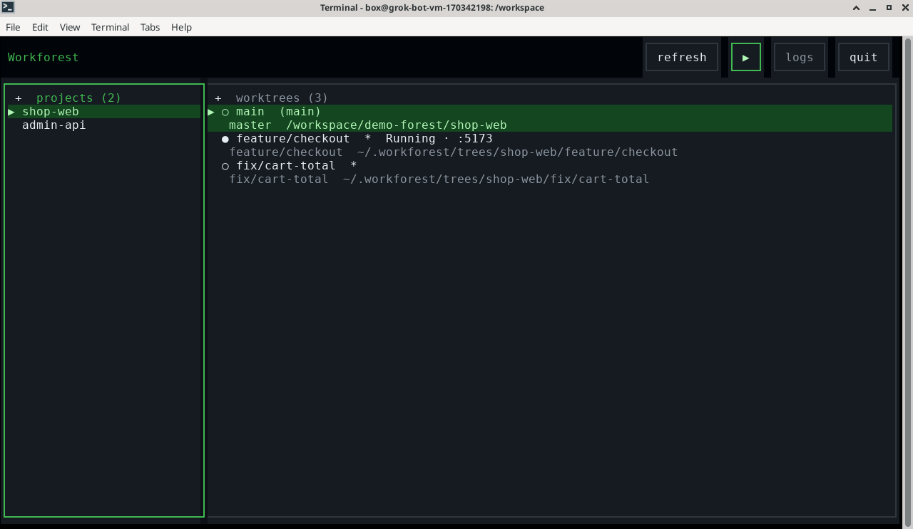
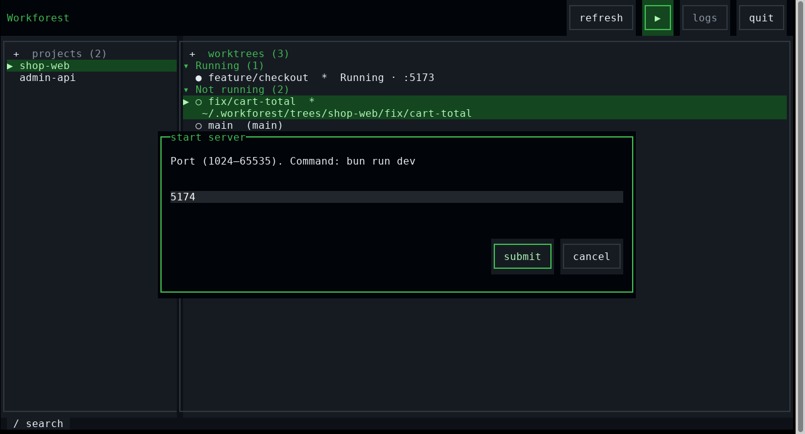
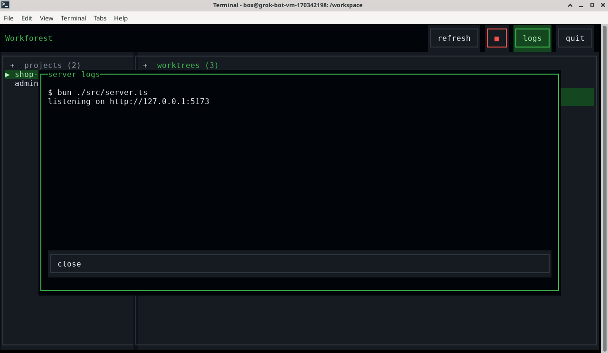

# Workforest

Terminal UI for git worktrees **and** the Bun/JS dev servers attached to them.

Registered projects stay where they are. Linked worktrees live under
`~/.workforest/trees/<project>/<name>/`.









## Quick start

Requires [Bun](https://bun.sh), `git`, and `lsof` (for discovering listeners).

```bash
git clone https://github.com/ayv4zyan/workforest.git
cd workforest
bun install
bun start
```

There is a `workforest` bin pointing at `src/index.tsx`, but the package is
`private: true` — not published to npm yet. Run from this clone (or
`bun link` locally if you want the name on your PATH).

Override the data dir with `WORKFOREST_HOME` (default `~/.workforest`).

## What it does

| You need | Workforest |
| --- | --- |
| Register a repo without moving it | `a` or **+** on the projects pane |
| New linked worktree (dir name = branch name) | `n` or **+** on worktrees |
| Ready-to-run tree | Copies `.env*`; symlinks `node_modules` when lockfiles match, else `bun install` |
| Dev server on a chosen port | **▶** / start dialog — remembers last port, suggests from 5173 up |
| Vite / Next | Passes `--port` / `-p`; sets `PORT` and `VITE_PORT` |
| Other stacks | **Edit start command** on the project (shell or `bun run …`) |
| See what’s running | Worktrees grouped **running** / **stopped** (collapsible); ○ stopped · Starting · Running `:port` · Failed; tags external / multi-server |
| Paths | Shown for the selected row; long names truncate |
| Search | `/` or bottom **search** — filter the focused pane by displayed name |
| Logs / stop | Header **logs** and **■**; stop confirms before killing external PIDs |
| Rename | Branch by default; optional folder move; or **auto** via Codex Luna |

Two panes: **projects** and **worktrees**. Mouse-first (click, double-click to activate, wheel, right-click / **⋯** menus). Keyboard still works.

## Keys

| Key | Action |
| --- | --- |
| `tab` / `shift+tab` | Next / previous control in the current row, or in a dialog |
| `←` / `→` | Previous / next pane, header button, pane control, or dialog button. In a dialog text field, move the cursor |
| `↓` / `↑` | Header ↔ panes ↔ pane controls; in a dialog, field ↔ buttons |
| `/` | Search the focused pane by displayed name; Enter keeps the filter, Esc clears it |
| `j` / `k` | Down / up in the focused list |
| `a` | Register project |
| `n` | New worktree |
| `r` | Rename (manual or auto) |
| `shift+r` | Auto-rename via Codex |
| `d` | Delete linked worktree |
| `u` | Unregister project (trees stay on disk) |
| `m` / `shift+f10` | Row menu |
| `enter` | Activate / submit |
| `esc` | Close menu or dialog |
| `g` | Refresh |
| `q` | Quit |

Search matches displayed names as you type (case-insensitive). Paths are not searched. Each pane keeps its own filter beside the title.

Adding a project offers live directory suggestions for absolute, relative, and `~/` paths. **Tab** or **→** at the end of the field completes a segment; **↑/↓** highlights a suggestion and **Enter** applies it. Click a suggestion to apply it, or use the wheel to move the highlight. Press **Enter** again (or click **submit**) to register the path through Git validation. **Shift+Tab** reaches the dialog buttons. Suggestions are capped at 20, omit files and common noise directories, and show hidden directories only when the segment starts with `.`.

## vs alternatives

| | `git worktree` CLI | Typical worktree TUI | IDE worktree UI | Workforest |
| --- | --- | --- | --- | --- |
| Linked trees | ✓ | ✓ | ✓ | ✓ under `~/.workforest/trees` |
| Leave main checkout in place | ✓ | ✓ | ✓ | ✓ |
| Start / stop / logs per tree | — | — | sometimes | ✓ |
| Port memory + conflict check | — | — | — | ✓ |
| Discover external listeners | — | — | — | ✓ (`lsof`) |
| `.env*` + smart `node_modules` | DIY | DIY | DIY | ✓ |

## Auto-rename (optional)

Rename → **auto**, or `shift+r`. Needs `codex` on PATH, `codex login`, and Luna
(`gpt-5.6-luna`). Suggests `agent/…` names from the branch diff (`.env*` and
untracked contents excluded). Review, edit, submit — renames the branch by
default, with an optional folder move. Esc cancels generation. Main and
detached trees are skipped. 2-minute timeout.

## Layout on disk

```
~/.workforest/
  config.json          # registered projects (paths never moved)
  ports.json           # last port per worktree
  trees/<id>/<name>/   # linked worktrees
  run/                 # owned server pid records
  logs/                # server output
```

## Develop

```bash
bun test
bun run typecheck
```

Stack: Bun · [OpenTUI](https://github.com/anomalyco/opentui) (Solid) · TypeScript.
